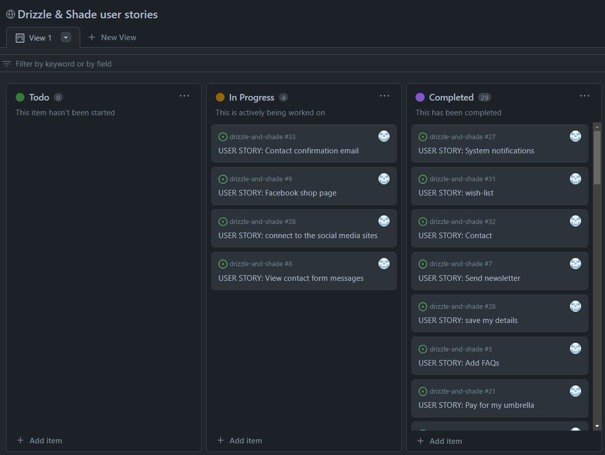

# Project overview

Project for Code Institute Full-stack development program: E-commerce Applications

View the [Live site](https://drizzleandshade-4e77ed93aac5.herokuapp.com/)

This website is for educational purposes only and the credit card payment functionality is not set up to accept real payments. 

If testing interactively, feel free to use card details below. Further information can be viewed via [Stripe documentation test page](https://stripe.com/docs/testing)
* 4242424242424242 (Visa)
* Expiration date = Any future date (Example: 12/24)
* CVN = any 3 digits (Example: 132)
* Zip code = any 5 digits (Example: 12345)

## Project goals

The site will offer users a modern and user-friendly e-commerce website that sell umbrellas. The website aims to provide a seamless shopping experience for users looking to purchase high-quality umbrellas for protection against rain or sun. The site will incorporate essential e-commerce features, including product listings, shopping cart functionality, secure payments, and a user-friendly interface. The goal is to attract customers, generate sales, and establish a reputable online presence for umbrella sales.

## Target Audience

The target audience for the website includes individuals of all ages and demographics who require umbrellas for various purposes, such as protection from rain or sun. The website will cater to both individual customers and businesses seeking bulk orders for promotional or corporate purposes.

# Planning

## Agile Planning

This project was developed using agile methodologies by delivering features in sprints. There were 4 sprints in total, the work was carried out over four weeks.

Initially user stories were developed, and acceptance criteria was created in order to define the functionality of the required feature. These user stories were assigned to epics (milestones) and prioritised under the labels, Must have, Should have, and Could have. Then they were assigned to sprints and story pointed, according to complexity. Must have user stories were completed first, followed by should haves and then finally could haves. This approach was taken to ensure that all core requirements were completed first, with the nice to have features being added should there be capacity.

In GitHub projects, a Kanban board was used to track the progress of the project, the workflow started with To do then In Progress and Done.

View the [Kanban board](https://github.com/users/michelleconville/projects/6/)

 

## User stories 

(Broken down by Epic)

Epic 1: Site Owner

* As a site owner I can log in/out from the admin panel so that I have full access to the site back-end
* As a site owner I can add new product to the shop so that I can make sure the website is up to date
* As a site owner I can edit/delete products so that I can make sure the website is up to date
* As a site owner I can add new categories to the shop so that I can make sure the website is up to date
* As a site owner I can edit/delete categories so that I can make sure the website is up to date
* As a site owner I can add FAQs to the site so that I can make sure that the shopper can find answer
* As a site owner I can send out a newsletter so that I keep customers updated
* As a site owner I can view messages sent via contact form so that I can act upon them
* As a site owner I have created Facebook shop page to increase traffic on my website

Epic 2: Product Details and navigation

* As a shopper I can easily navigate through the site so that I can view desired content
* As a shopper I can easily find a navigation bar and footer so that I can see what content there is on the website
* As a shopper I can easily see the products list so that I can see what the site has to offer
* As a shopper I can search products by category so that I can easily find what I'm looking for
* As a shopper I can sort products by rating, price and name so that I can easily find what I'm looking for
* As a shopper I can search for products using the search form so that I can find the products I'm specifically looking for
* As a shopper I can see the umbrella details page so that I can see the rating, price, short and description
* As a shopper I can read the FAQ's so that I can find the answer to my question or concern before contacting the site*

Epic 3: Shopping and Checkout

* As a shopper I can select the quantity of a product so that I can buy more 
* As a shopper I can add an umbrella to the shopping bag so that I can keep track of what I am spending
* As a shopper I can see the shopping bag summary and total cost so that I can see how much I will spend
* As a shopper I can remove items from shopping bag so that I don't buy what I don't want
* As a shopper I can put in my card details so that I can pay for my umbrella
* As a shopper I receive order confirmations so that I can be sure my order has been processed

Epic: Accounts

* As a shopper I can easily see if I'm logged-in or logged-out so that I can be sure what my status is
* As a shopper I can log in/out of my account if I wish so that I can connect or disconnect from the website
* As a shopper I can register for an account so that I can use features for logged-in users
* As a shopper I can receive a confirmation email when creating an account so that I know the registration was successful
* As a logged-in shopper I can save my details so that I don't have to retype my address every time

Epic: Communication

* As a shopper I can see ratings and reviews so that I can read the opinions of other shoppers
* As a shopper I am notified about any actions I have made so that I have a clear understanding of what has been completed/updated
* As a shopper I can connect to the social media sites so that I can follow them and keep up to date with their products and promotions
* As a shopper I can sign up for the website's newsletter so that I can keep up to date with new products and promotions
* As a logged-in shopper I can leave a rating and reviews so that I can share my experience with others
* As a logged-in shopper I can save selected products to my wishlist for later purchase
* As a shopper I can contact the store so that I can find out information that I require
* As a shopper I can receive a contact confirmation email to let me know that my email has been sent

## Technology

### Languages Used
*   HTML - The structure of the Website was developed using HTML as the main language.
*   CSS - The Website was styled using custom CSS in an external file.
*   JavaScript - This was used to make the message automaticly close
*   Python - The main programming language used for the application using the Django Framework.

### Frameworks Used
*   [Django](https://www.djangoproject.com/) - A high-level Python web framework that encourages rapid development and clean, pragmatic design.
*   [Bootstrap](https://getbootstrap.com/) - A framework for building responsive, mobile-first sites.

### Libraries Used
*   [Django Allauth](https://django-allauth.readthedocs.io/en/latest/index.html) - is used for user authentication, registration & account management to the site.
*   [Django Crispy Forms](https://django-crispy-forms.readthedocs.io/en/latest/) - is used to add bootstrap styling to the forms used.
*   [Django Countries](https://pypi.org/project/django-countries/) - is used for the country CountryField in the checkout page.
*   [jQuery](https://jquery.com/) - is used for styling components and also in some of the custom JS used throughout the site.
*   [Google Fonts](https://fonts.google.com/) - is used for websites font
*   [Font Awesome](https://fontawesome.com/) - is used for all the icons on the site.
*   [Mailchimp](https://mailchimp.com/) - is used to create the newsletter signup form.
*   [Facebook Pages](https://www.facebook.com/)
*   [Stripe](https://stripe.com/gb) - is used for the processing of payments.
*   [Heroku](https://dashboard.heroku.com/apps) - is used to deploy the site.
*   [Gunicorn](https://gunicorn.org/) - is used as the server to run Django on Heroku.
*   [Amazon AWS](https://aws.amazon.com/) - is used store the static and media files for the site.
*   [PostgresSQL](https://www.postgresql.org/) - is used as the database for the site.
*   [Git](https://git-scm.com/) - is used as version control 
*   [Github](https://github.com/) - is used to store the project's code.
*   [pillow](https://pypi.org/project/Pillow/) - Python imaging library
*   [psycopg2](https://pypi.org/project/psycopg2/) - database adapter which allow us to connect with a postgres database
*   [boto3](https://pypi.org/project/boto3/) - Allows connection to AWS S3 bucket

### Database Used
sqlite3 is used for development.

[ElephantSQL](https://www.elephantsql.com/) for deployment to heroku.

### Stripe
[Stripe](https://stripe.com/gb) has been used for the payment for this website.

The developer mode in Stripe allows us to use and process test payments.

Type | card No | Expiry | CVC | ZIP
--- | --- | --- | --- | ---
Success | **4242 4242 4242 4242** | A date in the future | Any 3 digits| Any 3 digits
Require authorisation | **4000 0027 6000 3184** | A date in the future | Any 3 digits| Any 5 digits

## Security Features and Defensive Design
For user authentication, Django's allauth was used for login and sign up functionality.

Views were secured where needed using the Django decorator @login_required. Access to the views using the @login_decorator can only be accessed by registered users. This means that if a user tries to access a view that is decorated with @login_required, but they are not currently logged in, they will be redirected to the login page instead.

Environment variables are stored in an env.py for security purposes to ensure no secret keys, api keys or sensitive information was added the repository. In production, these variables were added to the Heroku config vars within the project.

Cross-Site Request Forgery (CSFR) tokens are used on all forms throughout the project.

## Deployment

The site was deployed via [Heroku]( https://id.heroku.com/login), details of the steps taken to deploy the project can be found [here](DEPLOYMENT.md)

## Credits

### Code

* The Code Institute Boutique Ado walkthrough project provided a lot of the site's original functionality, which was then modified and expanded as needed.
* The code institute I Think Therefore I Blog walkthrough were also consulted whenever needed.

### Product content and images
* The description of the umbrellas and the images on the product details pages are taken from [amazon](https://www.amazon.co.uk/Umbrellas/b?ie=UTF8&node=2723115031)

### Media

* The main image for this project: Image by [efes](https://pixabay.com/users/efes-18331/?utm_source=link-attribution&utm_medium=referral&utm_campaign=image&utm_content=3795636) from [Pixabay](https://pixabay.com/?utm_source=link-attribution&utm_medium=referral&utm_campaign=image&utm_content=3795636)
* The Favicon for this project was made from Favicon
* The Icon for this project was taken from Font Awesome
* The Font for this project was taken from Google Fonts

### Others

* [Django documents](https://docs.djangoproject.com/en/4.1/)
* [Stack Overflow](https://stackoverflow.com/)
* [GeeksforGeeks](https://www.geeksforgeeks.org/)
* [Medium](https://medium.com/all-about-django)

##  Acknowledgements

* Thanks to everybody from the Code Institute Slack community
* Special thanks to my mentor Daisy for her assistance throughout this project.