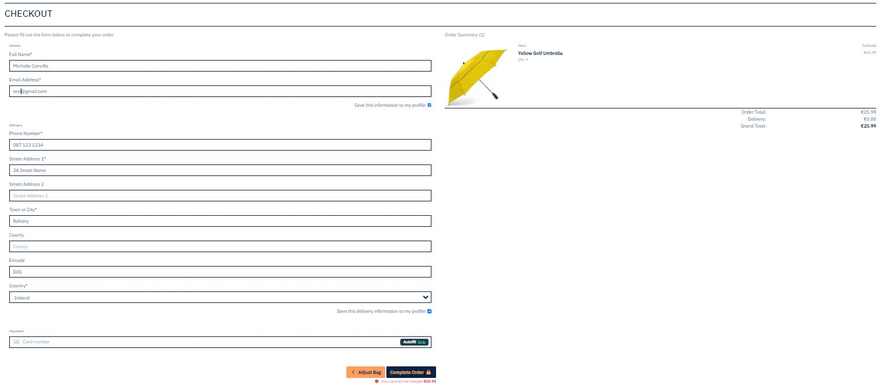

# Drizzle & Shade

## Project overview

Project for Code Institute Full-stack development program: E-commerce Applications

 

View the [Live site](https://drizzleandshade-4e77ed93aac5.herokuapp.com/)

or scan the QR code

 

This website is for educational purposes only and the credit card payment functionality is not set up to accept real payments. 

For testing interactively, feel free to use card details below. Further information can be viewed via [Stripe documentation test page](https://stripe.com/docs/testing)
* 4242424242424242 (Visa)
* Expiration date = Any future date (Example: 10/24)
* CVN = any 3 digits (Example: 123)
* Zip code = any 5 digits (Example: 12345)

## Project goals

The site will offer users a modern and user-friendly e-commerce website that sell umbrellas. The website aims to provide a seamless shopping experience for users looking to purchase high-quality umbrellas for protection against rain or sun. The site will incorporate essential e-commerce features, including product listings, shopping cart functionality, secure payments, and a user-friendly interface. The goal is to attract customers, generate sales, and establish a reputable online presence for umbrella sales.

## User Experience

### Target Audience

The target audience for the website includes individuals of all ages and demographics who require umbrellas for various purposes, such as protection from rain or sun. The website will cater to both individual customers and businesses seeking bulk orders for promotional or corporate purposes.

### User Requirements and Expectations 

* A visually appealing, accessible, and easy to use site 
* An intuitive navigation with logical workflows for purchasing an umbrella
* An ability to view information on products and manage personal data

# Planning

## Agile Planning

This project was developed using agile methodologies by delivering features in sprints. There were 4 sprints in total, the work was carried out over four weeks.

Initially user stories were developed, and acceptance criteria was created in order to define the functionality of the required feature. These user stories were assigned to epics (milestones) and prioritised under the labels, Must have, Should have, and Could have. Then they were assigned to sprints according to complexity. Must have user stories were completed first, followed by should haves and then finally could haves. This approach was taken to ensure that all core requirements were completed first, with the nice to have features being added should there be capacity.

In GitHub projects, a Kanban board was used to track the progress of the project, the workflow started with To do then In Progress and Done.

View the [Kanban board](https://github.com/users/michelleconville/projects/6/)

 

## User stories 

(Broken down by Epic)

Epic 1: Site Owner

* As a site owner I can log in/out from the admin panel so that I have full access to the site back-end
* As a site owner I can add new product to the shop so that I can make sure the website is up to date
* As a site owner I can edit/delete products so that I can make sure the website is up to date
* As a site owner I can add new categories to the shop so that I can make sure the website is up to date
* As a site owner I can edit/delete categories so that I can make sure the website is up to date
* As a site owner I can add FAQs to the site so that I can make sure that the shopper can find answer
* As a site owner I can send out a newsletter so that I keep customers updated
* As a site owner I can view messages sent via contact form so that I can act upon them
* As a site owner I have created Facebook shop page to increase traffic on my website

Epic 2: Product Details and navigation

* As a shopper I can easily navigate through the site so that I can view desired content
* As a shopper I can easily find a navigation bar and footer so that I can see what content there is on the website
* As a shopper I can easily see the products list so that I can see what the site has to offer
* As a shopper I can search products by category so that I can easily find what I'm looking for
* As a shopper I can sort products by rating, price and name so that I can easily find what I'm looking for
* As a shopper I can search for products using the search form so that I can find the products I'm specifically looking for
* As a shopper I can see the products details page so that I can see the rating, price, short and description
* As a shopper I can read the FAQ's so that I can find the answer to my question or concern before contacting the site*

Epic 3: Shopping and Checkout

* As a shopper I can select the quantity of a product so that I can buy more 
* As a shopper I can add an umbrella to the shopping bag so that I can keep track of what I am spending
* As a shopper I can see the shopping bag summary and total cost so that I can see how much I will spend
* As a shopper I can remove items from shopping bag so that I don't buy what I don't want
* As a shopper I can put in my card details so that I can pay for my umbrella
* As a shopper I receive order confirmations so that I can be sure my order has been processed

Epic: Accounts

* As a shopper I can easily see if I'm logged-in or logged-out so that I can be sure what my status is
* As a shopper I can log in/out of my account if I wish so that I can connect or disconnect from the website
* As a shopper I can register for an account so that I can use features for logged-in users
* As a shopper I can receive a confirmation email when creating an account so that I know the registration was successful
* As a logged-in shopper I can save my details so that I don't have to retype my address every time

Epic: Communication

* As a shopper I can see ratings and reviews so that I can read the opinions of other shoppers
* As a shopper I am notified about any actions I have made so that I have a clear understanding of what has been completed/updated
* As a shopper I can connect to the social media sites so that I can follow them and keep up to date with their products and promotions
* As a shopper I can sign up for the website's newsletter so that I can keep up to date with new products and promotions
* As a logged-in shopper I can leave a rating and reviews so that I can share my experience with others
* As a logged-in shopper I can save selected products to my wishlist for later purchase
* As a shopper I can contact the store so that I can find out information that I require
* As a shopper I can receive a contact confirmation email to let me know that my email has been sent

## Design 

### Colour Scheme

The color palette for this project was kept as simple as possible to maintain the contrast between the background and the foreground. These are vibrant colors that I think offset each other really and work together.

 

### Typography

The fonts used are IBM Plex and Pangolin. Fonts were imported from Google Fonts. The backup font of sans was used in case the fonts do not load for the user.

### The structure

The site was designed to be user-friendly and responsive, with the navigation bar along the top of the pages and a hamburger menu button for smaller screen.

#### Features and Functionality

User Registration and Authentication

* User registration and login functionality for customers to create and manage their accounts.
* User authentication and access control to ensure secure and personalised experiences.

Product list

* Display a comprehensive list of umbrellas.
* Categorise products based on different criteria such as price, rating and category.
* Provide detailed product information including images, description and stock levels, if low or out of stock.

Shopping bag and Checkout

* Allow customers to add products to their shopping bag and manage quantities.
* Implement a secure and intuitive checkout process, including address and payment information collection.
* Integration with payment gateway to facilitate secure online transactions.

Search and Filtering

* Include a search functionality to allow customers to find products based on keywords or specific criteria.
* Enable filtering options to refine product search results based on predetermined attributes.

Responsive Design

* Develop a user-friendly and responsive website that provides optimal user experience across different devices and screen sizes.
* Ensure seamless navigation and readability on across all device types.

Admin Panel

* Implement an admin panel for site owners/staff to manage categories, products, stock levels and the FAQs.

Account overview

* Implement a ‘my profile’ page to update their delivery information for future purchases and track orders.
* Ensure customers have the facility to change their password

Wishlist

* Provide customers with the ability to add products to their wishlist for future reference and easy access.
* Allow customers to manage their wishlist, including adding and removing products via the account overview.

Contact Us

* Implement a contact form customers or future customers to reach out to the customer support.

FAQs

* Provide a means for site owners/staff to create FAQ and answers.

Stock Management

*   Implement a page to view sotck levels of each product and provide the site owners/staff the ability to update them.

Delivery Management

*   Implement a page to view orders and provide the site owner/staff the ability to update the order once it has been shipped. 

#### Wireframes

These are the initial wireframes for the project to show the website's layout, during development some aspects may change. Each wireframe shows the desktop and mobile view.

Homepage

 

Products page

 

Product detail page

 

Shopping bag

 

Checkout

 

Admin panel

 

Category management

 

Stock management

 

FAQS

 

Account overview

 

Wishlist

 

Contact us

 

#### Database

ADD MORE TO THIS SECTION!!!!!!!!!!!!!!!!!!!!

An entity relationship diagram was created and shows the schemas for each of the models and how they are related.

## Features

### Common features 

        As a shopper I can easily navigate through the site so that I can view desired content

#### Navigation bar

        As a shopper I can easily find a navigation bar and footer so that I can see what content there is on the website

The navigation bar, which can be found on all pages, enables users to quickly access the site's key pages without having to use their browser's navigation buttons. It contains the Drizzle & Shade logo which doubles as the link for the homepage, the other links are an All Products mega dropdown menu, All Umbrellas mega dropdown menu, Contact Us and FAQs. There is a Search bar, a My Account link with Account related dropdown, and a link to the customers shopping bag.

The navigation menu will display on all pages and changes into a hamburger menu on smaller devices. This will allow users to view the site from any device.

The navigation options are different depending on whether the user is an end user or a staff user. If an end user chooses to register and/or login, the following navigation options are available:

* Home
* All Products  -> By Price
                -> By Rating
                -> By Category
                -> All Products
* All Umbrellas -> Beach Umbrellas
                -> Childrens Umbrellas
                -> Foldable Umbrelllas
                -> Golf Umbrellas
                -> All Umbrellas
* Contact Us
* FAQs
* My Account -> Account Overview -> My Profile -> My Wishlist
* Shopping Cart

If a staff user chooses to register and/or login, additional options are available Shipping:

* Admin Panel -> Category and Product Management -> Stock Management -> Shipping Management -> FAQ Management

 

#### Informational banner

An informaitonal banner is locationed under the navigation bar, it currently displays a message *Free delivery on order over €20!* 

A marquee tag was included to to create scrolling text horizontally across the site.

 

#### Footer

        As a shopper I can easily find a navigation bar and footer so that I can see what content there is on the website
        As a shopper I can connect to the social media sites so that I can follow them and keep up to date with their products and promotions
        As a shopper I can sign up for the website's newsletter so that I can keep up to date with new products and promotions
        As a shopper I can contact the store so that I can find out information that I require

The footer has been added to the bottom of the website, this contains 4 sections  - Subcribe, Products, Help and Contact.

* The subscribe section contains a link to the sites newsletter signup form. The newsletter form is connected to a mailchimp so emails entered there will be saved.
* The products section contains links to the various product categories.
* The help sections contains links to the FAQs area, the Privacy Policy and the Terms And Conditions.
* The contact area contains the contact information for Drizzle & Shade and a link to the sites Facebook page. The Facebook link is displayed with the Facebook icon provided by Font Awesome. 

There is also a small portion of text for the Copyright/Disclaimer. A link to my Github repository is provided. 

 

#### Product Search

        As a shopper I can search for products using the search form so that I can find the products I'm specifically looking for

The product search input bar can be used on any page in the navigation bar, the user can enter a search query and then they will be brought to the Products Page where their search results will appear. If there are no results for the user's query text will display advising the User that 0 products found for that search query.

##### Search bar

 

##### Search result found

 

##### No search result found

 

### Features For All Users

#### Homepage

The Homepage was designed as a single landing page. It consists of a hero image and placed on the image is Drizzle & Shades slogan *Embrace the weather, unleash your style* and a call to action button to shop now. The call to action button links to the all product page.

#### All products page

The Products page displays a list of all the Products that are sold by Drizzle & Shade. 

        As a shopper I can easily see the products list so that I can see what the site has to offer
        As a shopper I can search products by category so that I can easily find what I'm looking for
        As a shopper I can sort products by rating, price and name so that I can easily find what I'm looking for

* Products are presented in a grid format, allowing users to browse all products.
* Each product card includes information such as product name, image, price and rating.
* A badge appears in the product card to advise the user if the product is low in stock or out of stock.
* Sorting Products is available to the user, products can be sorted by Price, Rating and Category.
* There is a back to top button if users wish to get back to the top easily.
* Pagination is enable to display 8 products per page.
* Users can click on a product to view more details including a description of the product, a quantity input for however amount of items they want to puchase and add to wishlist and add to cart buttons. 
* Edit and delete functionality is ability available for the site owners/staff only.

#### Detailed Product page

The Product Details page contains all the information related to the Product. The product page is broken down into two parts, the product information section and the review section. 

                As a shopper I can see the products details page so that I can see the rating, price, short and description
                As a shopper I can select the quantity of a product so that I can buy more 
                As a shopper I can add an umbrella to the shopping bag so that I can keep track of what I am spending
                As a logged-in shopper I can save selected products to my wishlist for later purchase

The product information section contains:

* The name of the product, the price, the catagory the product is in, the rating of product, a description and the product image.
* A badge appears under the price to advise the user if the product is low in stock or out of stock.
* A quanity selector if the user would like to purchase more than one item.
* An add to cart button, this button is disabled if the product is out of stock
* An add to [wishlist](#my-wishlist) icon, users need to be logged in for this functionality to work, a modal will display if the user selects the button and is not logged in.
* Toast messages will display advising the user of any actions completed on this page either if they have added an item to the cart or added or removed an item from the wishlist. The success toast message 

##### Product in stock

##### Product out of stock

                As a shopper I can see ratings and reviews so that I can read the opinions of other shoppers
                As a logged-in shopper I can leave a rating and reviews so that I can share my experience with others

The review section will allow any user read reviews that have been written by other users. Registered users can rate and add one review per product, they also have the ability to edit the review or delete it. If Product has not been reviewed the rating for the Product is set to 0. This will update with the average rating across all reviews.

##### Unregistered user

##### Registered user 

##### User left a comment

#### Shopping cart

                As a shopper I can see the shopping bag summary and total cost so that I can see how much I will spend

The bag icon in the navigation bar displays the total price of all items in your shipping cart and the icon colour changes to pink. If you have no items in your shopping cart the icon is blue.

                As a shopper I can select the quantity of a product so that I can buy more 
                As a shopper I can remove items from shopping bag so that I don't buy what I don't want

The shopping cart page provides an overview of all of the items added by the user, from this page the user can easily make their final purchasing decisions because they have the opportunity to update or remove goods from the shopping cart, then either proceed to the checkout or to keep shopping.

#### Checkout

                As a shopper I can put in my card details so that I can pay for my umbrella
                As a shopper I receive order confirmations so that I can be sure my order has been processed
                As a logged-in shopper I can save my details so that I don't have to retype my address every time

The checkout page is broken into two sections, a form section and an order summary section. 

 * The order form has all the necessary fields to handle the order. The required fields are marked with an asterisks. Below these fields there is a checkbox to save the information to your profile if you are logged in. 
 * The payment field is from Stripe. 
 * The order summary displays what the order contains. 
 * At the bottom there is a button to complete the order or to go back to the shop. There is also a summary shown how much the card will be charged.
 * Once the order has been completed a toast message will display advising that thr Order successfully processed!, once the order has been proceesed successful with Stripe and email confirmation will be sent to the user. 

#### Contact us

                As a shopper I can contact the store so that I can find out information that I require
                As a shopper I can receive a contact confirmation email to let me know that my email has been sent

The Contact Us page is available to all users and can be accessed from the Contact Us link in the Navigation bar. Once clicked the user will be redirected to the Contact Us page where they can select their type of query and add their message.

Once a contact form is submitted an email will be sent to the email address confirming receipt of message. The contact email contains a link to the site and also a link to the sites Facebook page.

**Managing the contact requests**

When logged in to the admin panel I have added a boolean field *Marked as done*. This will make it assist the staff users to keep track of the queries that have been received. 

#### Toasts

                As a shopper I am notified about any actions I have made so that I have a clear understanding of what has been completed/updated

Custom toasts were implemented throughout the site, there are four different categories, error, info, success and warning. Each message will display be 3 second before disappearing.

These are to provide feedback to the user when they act on the site. 

### Features For All Login Users

#### Account overview 

                As a shopper I can register for an account so that I can use features for logged-in users

When a user is logged in the account overview is displayed in the My Account dropdown. The account overview page displays information related to the user's account and provides links to various actions they can take.

* Link to the users profile
* Link to the users wishlist
* Link for the user to chage their password

#### My profile

                As a logged-in shopper I can save my details so that I don't have to retype my address every time

The Profile page contains 3 areas

* User details
* Order History
* Delete your profile

The User Details section contains all the Users' information like username, full name, phone number, and address. There is an Update details button available which allows the user to directly update their information from this page. 

The Order History section provides the user with a history of all their Orders. Each Order is displayed with the contents of the Order and a link to the Order Complete page containing all the information of order including Billing/Shipping.

The Delete button opens the Delete Profile modal where the user can choose to delete their Profile. Deleting Profile removes all Order History and Wishlist items also.

#### My Wishlist

                As a logged-in shopper I can save selected products to my wishlist for later purchase

The Wishlist section contains all the Products that the User has added to their Wishlist. The user can remove the Wishlist items by pressing the remove button.

Users can add/remove products to their Wishlist by clicking the Heart icon on a Product from the Product Detail page. If the Heart icon is solid it means it is in the users' Wishlist, if they click the icon again it will remove the Product from their Wishlist. 

Toasts will be displayed anytime a Product is added/removed from Wishlist. In the Wishlist section on the Profile page.

#### Change password

The user can change their password at any time. This page was created using one of the django-all-auth templates. 

### Features For Staff Login Users

#### Admin panel

                As a site owner I can log in/out from the admin panel so that I have full access to the site back-end

When logged in as an admin the Admin panel is displayed in the My Account dropdown, the admin panel displays links to additional functions available to staff to manage the website.

* Category and product management
* Stock management
* Manage shipping
* Manage FAQs

#### Category and product management

* Add a category
* Add a product

#### Category management

The Adding/Editing/Deleting of categories is only available to staff and are all available on the category management page. 

                As a site owner I can add new categories to the shop so that I can make sure the website is up to date
                As a site owner I can edit/delete categories so that I can make sure the website is up to date

A user can fill in category form and select the add category button, the category will then display in the cagegory list. From the category list there are edit and delete buttons. When staff members click the edit button they will be redirected to the Edit category page where they can update the category information or click the delete button and a model will open, the staff member will need to confirm they want to delete the cagegory.

* Adding a category

* Editing a category

* Deleting a category

#### Product management

The Adding/Editing/Deleting of Products is only available to staff. Here the staff member can select a products category and add the products details.

                As a site owner I can add new product to the shop so that I can make sure the website is up to date
                As a site owner I can edit/delete products so that I can make sure the website is up to date

When logged in as staff, on the Products page and Product Detail page a links are displayed on each Product card to either edit or delete. When staff members click the edit button they will be redirected to the Edit Product page where they can update the Product information or click the delete button and the product will be deleted. 

##### Adding a product

#### Stock management

This page displays a list of all products and the number of that product that is are available, a staff user can see at a glance the stock numbers with the colour coding. To add or remove stock, click on the update stock button and the update stock page opens. 

This is a basic stock management tool. When a customer purchases a product, the product is removed from stock. When a  product is low or out of stock, a badge will display on the product card on the product list page and on the detailed product page, the add to cart button is disabled when the product is out of stock.

##### Stock level

##### Managing stock levels

#### Managing shipping

This page displays a list of all orders, with the customers order number, full name and total and if the order has been shipped. 

To update the order to confirm it has been shipped, the staff user clicks on the edit button and the confirm shipping page opens. Once the order has been confirmed that the order has been shipped an email is sent to the customer to confirm their order is on its way. 

##### Order list page

##### Confirm shipping page

#### Manage FAQs

The FAQ page displays FAQs so that the user can easily find an answer.

                As a site owner I can add FAQs to the site so that I can make sure that the shopper can find answer
                As a shopper I can read the FAQ's so that I can find the answer to my question or concern before contacting the site

Through the FAQ page, the staff user can add a question and its answer, and it will be displayed on the website straight away.

Staff users can edit, update and delete a faqs.

##### FAQ page

##### Add an FAQ 

##### Edit an FAQ 

##### Delete an FAQ 

### Site Authentication

#### AllAuth

The AllAuth pages have been styled in line with the site theme, included are Sign Up, Login, Logout, and email/password-related pages.

##### Login page

##### Register page

##### Logout page

##### Forgot password page 

### Error messages

#### 404 error

A 404 page has been implemented and will display if a user navigates to a broken link / missing page.

The 404 page will allow the user to easily navigate back to the main website if they direct to a broken link / missing page, without the need of the browsers back button.

#### 403 error 

A 403 error page has been implemented to provide feedback to the user when they try to access unauthorised content.

Users will be directed to this page if they alter the URL's and attempt to edit, delete or access pages that are restricted.

#### 500 error 

A 500 error page has been displayed to alert users when an internal server error occurs.

The message outlines to users that the problem is with the website not anything they have done.

### Privacy Policy and Terms and Conditions

In the help section in the footer, there are links to the site's Privacy Policy and Terms & Conditions.

As the site collects some user data it made sense to add a Privacy Policy. This was created using the [Privacy Policy Generator](https://www.privacypolicygenerator.info/)

The Terms and Conditions page was built using [WebsitePolicies](https://www.websitepolicies.com/) and was added to provide further information to the user.

### Favicon

A site wide favicon was implemented. This provides an image in the tabs header to allow the user to easily identify the website if they have multiple tabs open.

## Future Features

* A more advanced stock management system
* Add more payment options
* Logging in with social media accounts

## Technology

### Languages Used
*   HTML - The structure of the Website was developed using HTML as the main language.
*   CSS - The Website was styled using custom CSS in an external file.
*   JavaScript - This was used to make the message automaticly close
*   Python - The main programming language used for the application using the Django Framework.

### Frameworks Used
*   [Django](https://www.djangoproject.com/) - A high-level Python web framework that encourages rapid development and clean, pragmatic design.
*   [Bootstrap](https://getbootstrap.com/) - A framework for building responsive, mobile-first sites.

### Libraries Used
*   [Django Allauth](https://django-allauth.readthedocs.io/en/latest/index.html) - is used for user authentication, registration & account management to the site.
*   [Django Crispy Forms](https://django-crispy-forms.readthedocs.io/en/latest/) - is used to add bootstrap styling to the forms used.
*   [Django Countries](https://pypi.org/project/django-countries/) - is used for the country CountryField in the checkout page.
*   [jQuery](https://jquery.com/) - is used for styling components and also in some of the custom JS used throughout the site.
*   [Google Fonts](https://fonts.google.com/) - is used for websites font
*   [Font Awesome](https://fontawesome.com/) - is used for all the icons on the site.
*   [Mailchimp](https://mailchimp.com/) - is used to create the newsletter signup form.
*   [Facebook Pages](https://www.facebook.com/)
*   [Stripe](https://stripe.com/gb) - is used for the processing of payments.
*   [Heroku](https://dashboard.heroku.com/apps) - is used to deploy the site.
*   [Gunicorn](https://gunicorn.org/) - is used as the server to run Django on Heroku.
*   [Amazon AWS](https://aws.amazon.com/) - is used store the static and media files for the site.
*   [Git](https://git-scm.com/) - is used as version control 
*   [Github](https://github.com/) - is used to store the project's code.
*   [pillow](https://pypi.org/project/Pillow/) - Python imaging library
*   [psycopg2](https://pypi.org/project/psycopg2/) - database adapter which allow us to connect with a postgres database
*   [boto3](https://pypi.org/project/boto3/) - Allows connection to AWS S3 bucket

### Database Used
sqlite3 is used for development.

[ElephantSQL](https://www.elephantsql.com/) for deployment to heroku.

### Stripe
[Stripe](https://stripe.com/gb) has been used for the payment for this website.

The developer mode in Stripe allows us to use and process test payments.

Type | card No | Expiry | CVC | ZIP
--- | --- | --- | --- | ---
Success | **4242 4242 4242 4242** | A date in the future | Any 3 digits| Any 3 digits
Require authorisation | **4000 0027 6000 3184** | A date in the future | Any 3 digits| Any 5 digits

## Security Features and Defensive Design
For user authentication, Django's allauth was used for login and sign up functionality.

Views were secured where needed using the Django decorator @login_required. Access to the views using the @login_decorator can only be accessed by registered users. This means that if a user tries to access a view that is decorated with @login_required, but they are not currently logged in, they will be redirected to the login page instead.

Environment variables are stored in an env.py for security purposes to ensure no secret keys, api keys or sensitive information was added the repository. In production, these variables were added to the Heroku config vars within the project.

Cross-Site Request Forgery (CSFR) tokens are used on all forms throughout the project.

## Deployment

The final Deployed site can be found [here](https://drizzleandshade-4e77ed93aac5.herokuapp.com/). I have included details of the deployment process in a separate document called [DEPLOYMENT.md](DEPLOYMENT.md).

## Testing

I have included details of testing both during development and post-development in a separate document called [TESTING.md](TESTING.md)

## Credits

### Code

* The Code Institute Boutique Ado walkthrough project provided a lot of the site's original functionality, which was then modified and expanded as needed.
* The code institute I Think Therefore I Blog walkthrough were also consulted whenever needed.

### Product content and images
* The description of the umbrellas and the images on the product details pages are taken from [amazon](https://www.amazon.co.uk/Umbrellas/b?ie=UTF8&node=2723115031)

### Media

* The main image for this project: Image by [efes](https://pixabay.com/users/efes-18331/?utm_source=link-attribution&utm_medium=referral&utm_campaign=image&utm_content=3795636) from [Pixabay](https://pixabay.com/?utm_source=link-attribution&utm_medium=referral&utm_campaign=image&utm_content=3795636)
* The Favicon for this project was made from Favicon
* The Icon for this project was taken from Font Awesome
* The Font for this project was taken from Google Fonts

### Others

* [Django documents](https://docs.djangoproject.com/en/4.1/)
* [Stack Overflow](https://stackoverflow.com/)
* [GeeksforGeeks](https://www.geeksforgeeks.org/)
* [Medium](https://medium.com/all-about-django)

##  Acknowledgements

* Thanks to everybody from the Code Institute Slack community
* Special thanks to my mentor Daisy for her assistance throughout this project.