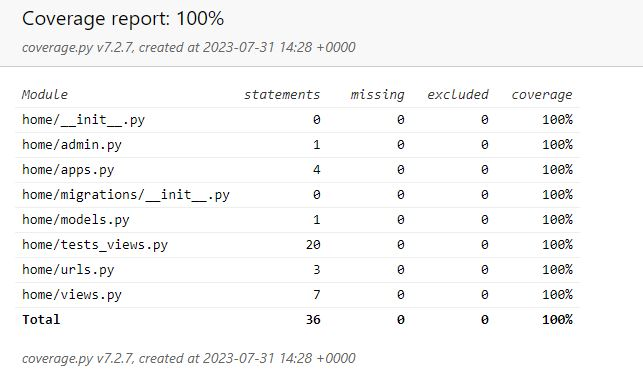
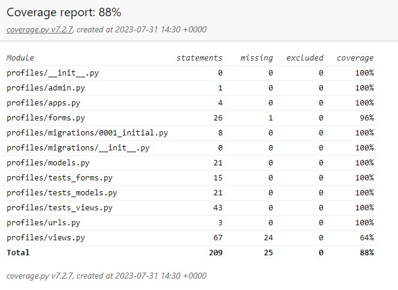
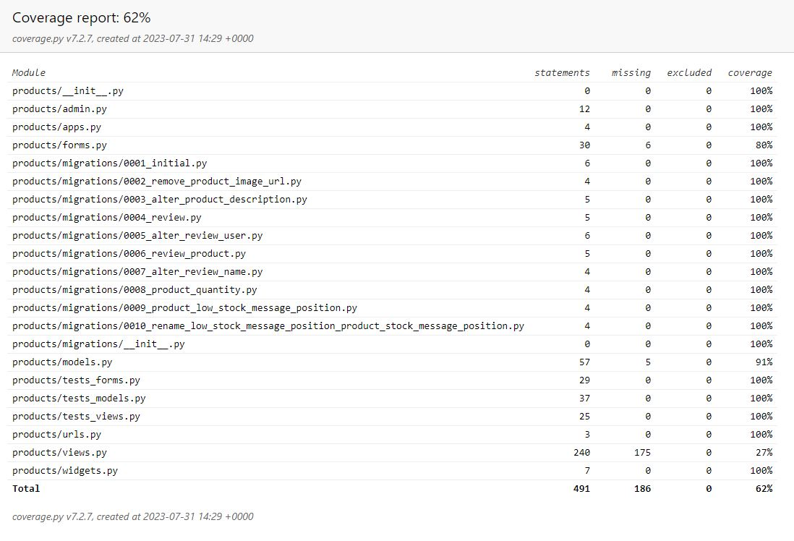
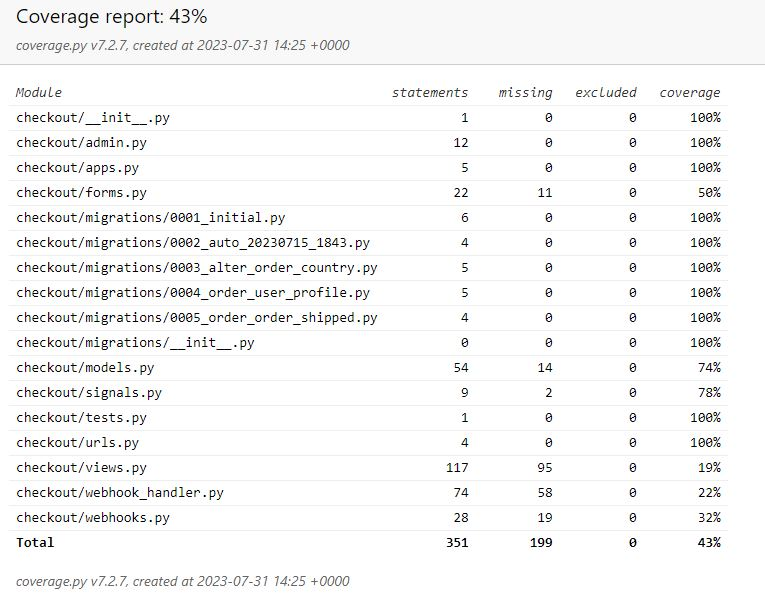
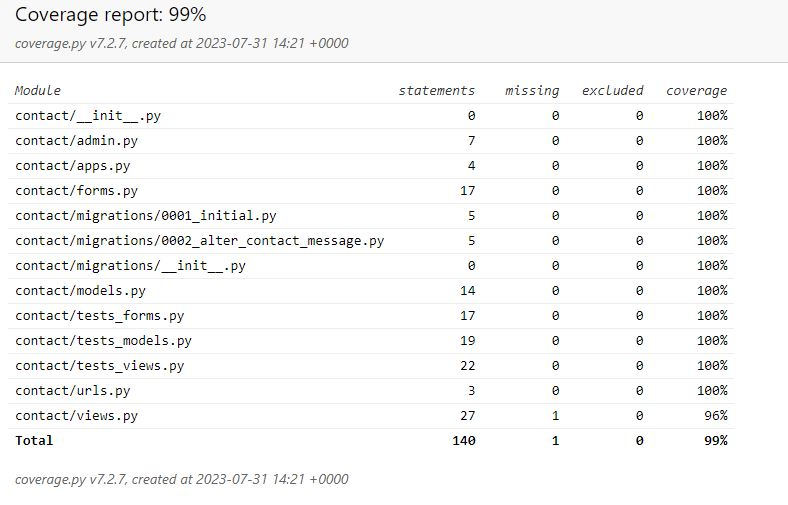
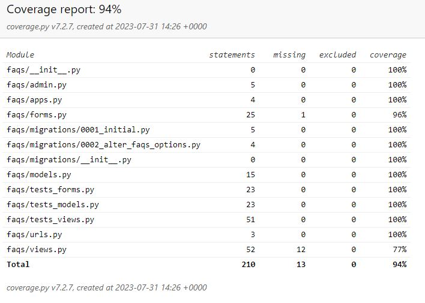
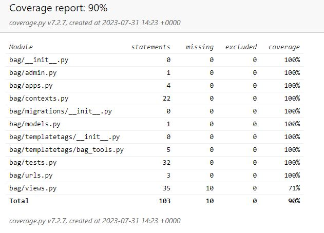

# Testing and Validation

I took a multi-stage approach to testing the site.

The first stage was continuous testing as the site was being developed. This was important to do during development of the django apps to ensure that the different models, views and forms contained or returned the correct data type or values. During the styling of the site, I checked the visual appearance within a live server window to preview the changes before they were committed to reduce the number of bugs.

For the second stage of testing, I used a more structured approach, I created both manual and automated test cases, using the user stories to ensure all the features worked as expected, I executed the tests individually making a note of any errors or changes to the designed behaviour. Any errors were corrected and then the tests repeated.

I then validated all the different types of code and ran performance and accessibility test across different browsers and device types.

Finally, I asked friends to look at the site on their devices and report any issues they came found. All issues reported have been resolved. 

## Table of Contents 
 - [Automated testing](#automated-testing)
 - [Manual Testing](#manual-testing)
 - [Validator Testing](#validator-testing)
 - [Testing Browser Compatibility](#testing-browser-compatibility)
 - [Bugs](#bugs)

## Automated testing

### Unit Testing

Unit tests were created to test the functionality of the apps. These can be found in the tests.py files in the respective apps.

Running the test suite
The tests are run in the terminal window by entering 

        python3 manage.py test 

This will automatically run all test. If running tests in quick succession, it's recommended to add --keepdb at the end, so the database doesn't have to be rebuild for every test cycle. All tests passed, but if one failed, it would be displayed with a clear error message, so errors can be resolved.

Home tests

 

Profiles tests

 

Products tests

 

Checkout tests

 

Contact tests

 

FAQs tests

 

Bag tests

 

### Site Coverage Report

Through my testing, I was able to get a total of 72% coverage across the site. The remaining 28% will be covered through the manual testing below.

View the site wide coverage report [coverage-report](coverage.txt)

## Manual Testing

##### Back to [top](#table-of-contents)

##### Back to [top](#table-of-contents)

## Validator Testing

##### Back to [top](#table-of-contents)

## Testing Browser Compatibility

The website was successfully opened and rendered correctly in Chrome (both desktop and mobile versions), Edge, Firefox and Safari.

### Responsiveness
All pages were tested to ensure responsiveness on screen sizes from 320px and upwards on the following browsers and devices

### Devices
*   iPhone SE
*   OnePlus Nord
*   Dell laptop

In addition to the above listed devices, the Google Chrome Developer Tools device toggling option for all available devices was used.

##### Back to [top](#table-of-contents)

## Bugs

##### Back to [top](#table-of-contents)

## Unfixed 

##### Back to [top](#table-of-contents)

